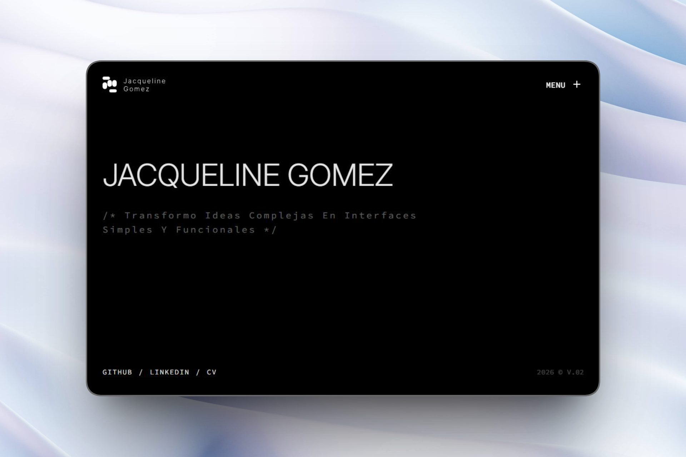

# Jacqueline Gomez — Portfolio

A high-end personal portfolio built with a focus on technical precision, aesthetic clarity, and smooth interactions. This project serves as a digital lab to explore the intersection between clean code and immersive user experiences.

[Live Demo](https://jacquelinegomezportfolio.vercel.app/) | [LinkedIn](https://www.linkedin.com/in/jacquelineegomez22/?locale=es-ES)



---

## 01. Tech Stack
| Category | Technology |
| :--- | :--- |
| **Framework** | **React** (Hooks & Functional Components) |
| **Styling** | **Tailwind CSS** (Custom Utility-first system) |
| **Animation** | **GSAP** + **ScrollTrigger** (Orchestrated motion) |
| **Language** | **JavaScript (JS)** |

## 02. Key Features
* **Custom Motion Engine**: Advanced use of GSAP for non-intrusive, narrative-driven animations.
* **Global Interaction State**: Managed via React Context for synchronized cursor behaviors across the app.
* **Modular Data Management**: Centralized project information for scalable maintenance and clean separation of concerns.
* **Adaptive UX**: Intelligent navigation and interaction systems that prioritize content visibility.

## 03. Project Structure
```text
src/
 ├── assets/      # Optimized assets & global styles
 ├── components/  # Atomic UI elements & Layout wrappers
 ├── context/     # React Context providers (Cursor & Global state)
 ├── data/        # Centralized project data & work descriptions
 ├── hooks/       # Custom hooks (Time logic, GSAP animations)
 └── pages/       # Main view components and routing
 ```

 ## 04. Installation
 ```bash
# Clone the repository
git clone https://github.com/JaGo-1/react-portfolio.git

# Install dependencies
npm install

# Run development server
npm run dev
 ```
